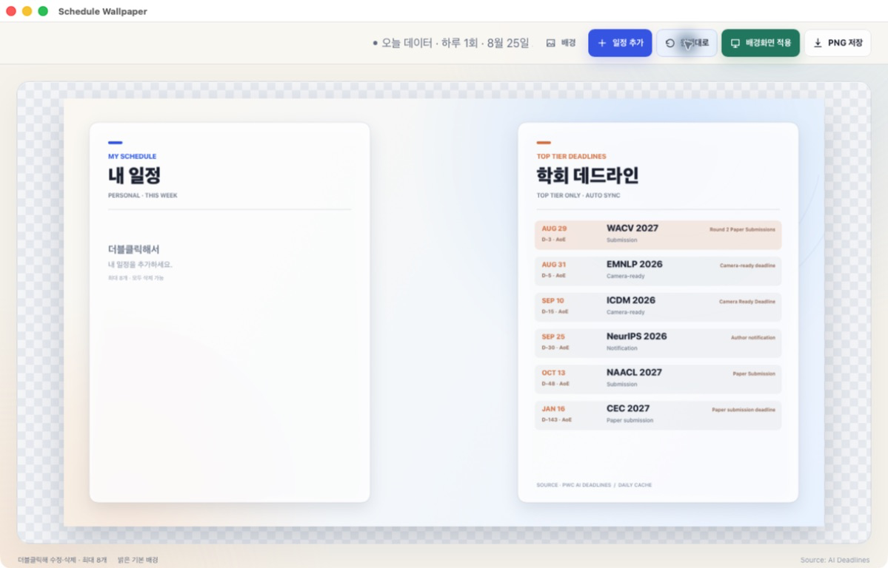

# Conference Schedule Wallpaper

A small, light-themed macOS and browser app for turning personal plans and upcoming top-tier AI conference deadlines into a 1920 × 1080 wallpaper.



## What it does

- Keeps personal events on the left and conference deadlines on the right.
- Edits the title or an event by double-clicking the wallpaper preview.
- Supports zero to eight personal events, including reordering and deletion.
- Selects personal-event dates with the native calendar picker.
- Uses an uploaded image, a solid color, or the built-in light background.
- Applies the current preview directly to one or more selected macOS displays and can restore the wallpaper captured before the first apply.
- Closes the window with `Command-W`, keeps the app running, and quits completely with `Command-Q`.
- Shows deadline type, D-day, and the source timezone such as `AoE`, `KST`, or `UTC`.
- Exports the current wallpaper as a 1920 × 1080 PNG.
- Refreshes conference data at most once every 24 hours.

## Conference deadline data

The conference data comes from [Papers with Code — AI Deadlines](https://paperswithcode.co/ai-deadlines). The local server requests the JSON endpoint used by that page:

```text
https://paperswithcode.co/api/v1/conferences/deadlines
```

The app reads these upstream fields:

- `short_name`, `name`, and `year` for the conference label
- `tier` for the upstream ranking
- `deadlines[].deadline_at` for the deadline timestamp
- `deadlines[].type` and `deadlines[].label` for the deadline category
- `deadlines[].timezone` for `AoE`, `KST`, `UTC`, and other source timezones
- `url` for the conference website

### Filtering and display rules

1. Keep only records whose upstream `tier` is exactly `a`.
2. Ignore deadlines that have already passed.
3. Keep the nearest upcoming deadline for each conference.
4. Sort the conferences chronologically and show up to seven.
5. Normalize categories to short English labels such as `Submission`, `Abstract registration`, `Notification`, and `Camera-ready`.
6. Calculate D-day from the viewer's local calendar date while preserving the timezone label supplied by the source.

`Top tier` therefore means the `tier: "a"` value supplied by Papers with Code. This project does not create or independently verify conference rankings. Deadlines can change, so important submissions should always be checked against the linked official conference website.

### Daily cache and failure behavior

`web/server.py` is a local-only HTTP server and API proxy. It stores the most recent validated response for 24 hours.

- The browser checks the local endpoint hourly, but the external Papers with Code request occurs at most once per 24-hour cache period.
- A new response replaces the cache only when it contains at least 50 conferences, at least 20 `tier: "a"` conferences, and at least 100 deadline entries.
- If the live request fails, the server explicitly returns the last valid cache as `stale-cache`.
- If both the live request and cache fail, the endpoint returns an error instead of silently pretending the refresh succeeded.
- Opening `index.html` directly uses the bundled snapshot because a `file://` page cannot use the local API proxy.

The upstream website and endpoint are third-party services and may change without notice.

## Download the macOS app

Download the latest `Schedule Wallpaper.app.zip` from this repository's [Releases](https://github.com/KimYeongHyeon/conference-schedule-wallpaper/releases/latest).

Requirements:

- Apple Silicon Mac
- macOS 13 or later
- `python3` available on the Mac

The app is locally/ad-hoc signed rather than notarized with an Apple Developer ID. If macOS blocks the first launch, right-click the app and choose **Open**.

In the Mac app, click **배경화면 적용**, choose one or more connected displays, and confirm. The chosen display IDs are remembered for the next action. Before the first apply, the app stores every connected display's existing wallpaper in `original-wallpapers.json`. **원래대로** lets you choose which displays to restore from that snapshot; later applies do not overwrite it.

## Run the browser version

```bash
cd web
./launch.command
```

Or run the server without opening a browser automatically:

```bash
python3 web/server.py --serve --port 18767
```

Then open <http://127.0.0.1:18767/>.

## Build the macOS app

The native shell uses AppKit and `WKWebView`; the web app and local Python server are copied into the application bundle.

```bash
mkdir -p "build/Schedule Wallpaper.app/Contents/MacOS" \
         "build/Schedule Wallpaper.app/Contents/Resources"

cp macos/Info.plist "build/Schedule Wallpaper.app/Contents/Info.plist"
cp macos/AppIcon.icns "build/Schedule Wallpaper.app/Contents/Resources/ScheduleWallpaperIcon.icns"

swiftc -O -target arm64-apple-macos13.0 \
  macos/main.swift \
  -framework AppKit \
  -framework WebKit \
  -o "build/Schedule Wallpaper.app/Contents/MacOS/ScheduleWallpaper"

ditto web "build/Schedule Wallpaper.app/Contents/Resources/web"
codesign --force --deep --sign - "build/Schedule Wallpaper.app"
```

## Privacy and local storage

- Personal events and background settings stay in the app/browser's local storage.
- Personal events are not sent to Papers with Code or any other external service.
- The only routine network request is the conference deadline request made by the local proxy.
- The native app keeps its conference cache in `~/Library/Application Support/Schedule Wallpaper/`.
- The native app also keeps the generated `current-wallpaper.png` and the original-wallpaper snapshot in that directory.
- The browser launcher keeps its cache in `web/data/`.

## Repository layout

```text
.
├── docs/preview.png       # Screenshot
├── macos/                 # AppKit/WKWebView wrapper, Info.plist, and app icon
└── web/                   # Browser app, local server, and cached snapshot
```

## Current version

`v1.4.5` — fixes the Dock icon after the app quits by using a cache-safe bundle icon resource, while retaining clearer sync freshness wording, cleaner single-event editing, the native calendar date picker, standard `Command-W` window closing and `Command-Q` app quitting, per-display macOS wallpaper apply/restore, image and solid-color backgrounds, native image picker, multiple personal events, daily conference sync, and PNG export.
